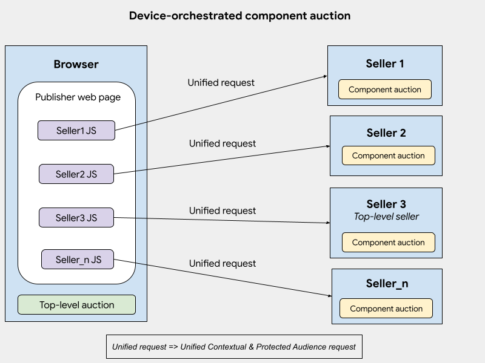
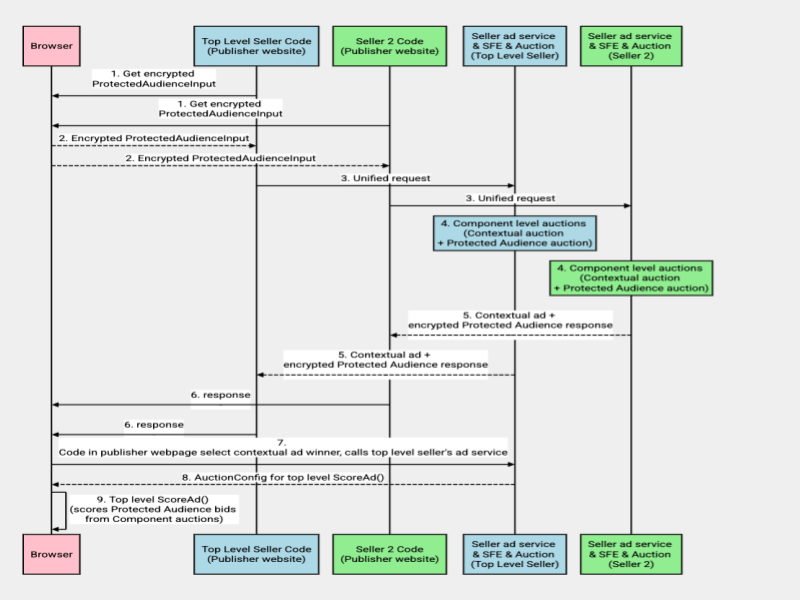
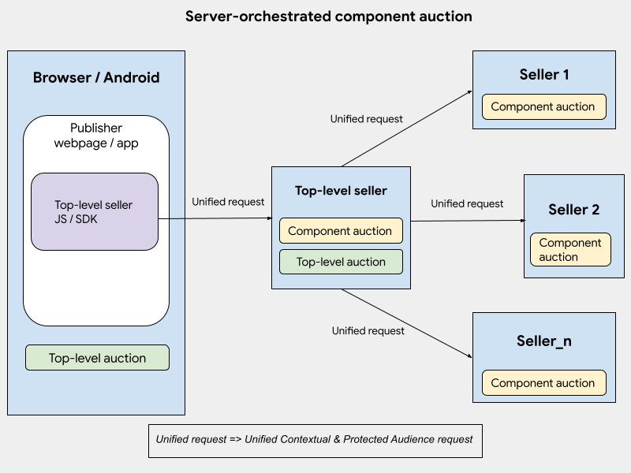
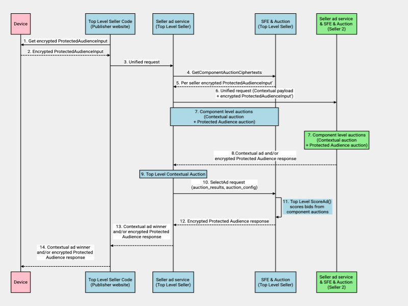
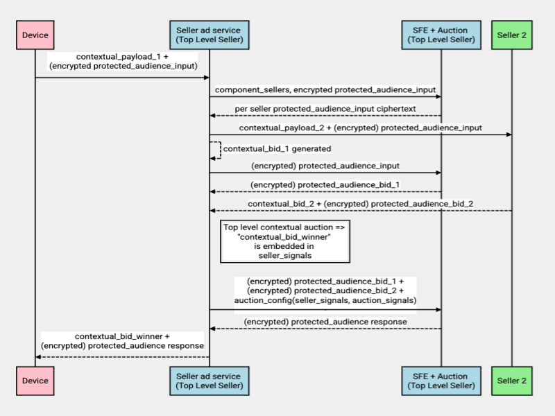

> FLEDGE has been renamed to Protected Audience API. To learn more about the name change, see the [blog post](https://privacysandbox.com/intl/en_us/news/protected-audience-api-our-new-name-for-fledge)

**Authors:** <br>
[Jaspreet Arora][2], Google Privacy Sandbox<br> 
[Priyanka Chatterjee][1], Google Privacy Sandbox

# Bidding and Auction Services Multi Seller Auctions
This document explains the proposed multi-seller auction flows using [Bidding and Auction services][3].
We propose following types of multi-seller auctions:
* Device-orchestrated component auction
* Server-orchestrated component auction

This explainer provides building blocks for ad techs to participate in multi-seller auctions with their
ad management solution. While this explainer does not provide step-by-step instructions for each specific
ad tech’s integration, we aim to provide options to meet your auction use cases. 

Refer to this [section][5] for related explainers. You can share feedback on the design by filing a [GitHub issue][4].

Additional questions remain open for comment. As we build this technology, we’ll provide more detailed
setup instructions.

_Note: We will publish reporting designs for multi seller auctions in a different explainer. If you
developed reporting scripts using [Chrome on-device Protected Audience specification][27], that would work
with [Bidding and Auction services][3]._

## Key terms and concepts
### Seller
A party running an ad auction, likely to be an ad tech supply-side platform (SSP).

### Buyer
A party bidding for ad space in an ad auction, likely to be a demand-side platform (DSP), or the advertiser
itself. Ad space buyers own and manage Protected Audience interest groups.

### Seller’s ad service
A server owned by a seller to orchestrate real-time bidding (RTB) requests and Protected Audience auction
requests to Bidding and Auction services.

### Unified request
A seller’s single request for the contextual and server-side Protected Audience auction, from their code
on a publisher site. This was described in the Bidding and Auction services high-level design and API
explainer.
* The seller’s ad service makes two sequential requests.
  * [Existing flow] The seller sends real-time bidding (RTB) requests to buyers for contextual bids,
    then conducts the contextual auction.
  * [Server side Protected Audience flow] The seller sends a SelectAd request to SellerFrontEnd service
    to start the Protected Audience auction. The request payload includes encrypted Protected Audience data,
    contextual signals, buyer_list, seller_origin, per_buyer_timeout and other necessary information.
* The SellerFrontEnd conducts the Protected Audience auction. It returns an encrypted response that
  includes either the winning bid, or an encrypted padded response if the contextual bid filters all
  Protected Audience bids. For privacy reasons, the seller's ad service will be unable to determine if
  the payload has a winning Protected Audience ad or not, so it should also pass the contextual winner
  to the client.

### Contextual auction
In this explainer, we use "Contextual auction" to mean everything that does not involve cross-site data.
This includes the contents of the web page or URL where the ad will appear, which is the traditional
sense of "contextual."  But for our purposes, first-party data that the publisher provides about their
user, or Seller-Defined Audience data, are also bundled into what we are calling "contextual".

### Component auction
An auction conducted by a single seller among a collection of buyers, as part of a multi-seller auction.
The auction winners then participate in a top-level auction. In a unified flow, the top-level auction
includes the winners for the contextual auction and/or the winner for the Protected Audience auction.
Each Component auction follows the single seller unified flow specified in Bidding and Auction Services
Design.

### Top-level auction
The auction which decides the final winner, conducted after individual seller auctions (component
auctions). 

Note: The top-level auction runner cannot use Protected Audience data to bring its own demand.
Therefore buyers can not participate in the top-level auction. The top-level auction scores winning bids
from component auctions. 

### Multi-seller auction
Auctions with participation from multiple sellers and their partner buyers, where the final winning ad
candidate is decided by a top level auction.

### Top-level seller
The sell-side ad tech or the publisher conducting the top-level auction. This ad tech specifies the
scoreAd() script and auction config for scoring the winning candidates from Component auctions.

### Component-level seller
The sell-side ad techs that integrate with a top-level seller and conduct their own Component auction.
The winners from those auctions are scored in the top-level auction.

## Timeline
We expect to make Multi seller auction support with Bidding and Auction services available for testing
by September 2023.

## Services overview


_This type of multi seller auction will be supported for web advertising with Bidding and Auction services._ 

The Bidding and Auction services allow Protected Audience computation to take place on cloud servers
with a [trusted execution environment][6] (TEE), rather than locally on a user's device. Each Bidding
and Auction service is hosted in a virtual machine (VM) within a secure, hardware-based TEE. Ad tech
platforms operate and deploy Protected Audience services on a public cloud. 

### Sell-side services
The sell-side services include the SellerFrontEnd service and the Auction service. The SellerFrontEnd
service orchestrates requests in parallel to buyers by communicating with multiple BuyerFrontEnd
Services. This service also fetches real-time scoring signals from the seller's Key/Value service
required for the auction and calls the [Auction service][7] for Protected Audience auction. The Auction
service will execute the seller-owned code to score the bids from their seller partners. Review a
detailed [overview of the sell-side services][8].

### Buy-side services
The buy-side services include the BuyerFrontEnd service and the Bidding service. The BuyerFrontEnd
service communicates with the Buyer-operated Key/Value services to fetch bidding signals and call
the Bidding service to generate bids. The Bidding service will execute the buyer-owned code to
generate the bids for the interest groups. Review a detailed [overview of the buy-side services][9].

The seller’s ad service starts the Protected Audience auction on the Auction service by sending a
request to the SellerFrontEnd Service with the encrypted Protected Audience data (from the browser),
and contextual signals in plaintext. Read about the Protected Audience auction [flow using the
Bidding and Auction Services][10].

## Design
The [Bidding and Auction services API][11] will be extended to support multi-seller auction flows,
with an updated API.  There are two different ways in which a multi-seller auction could make use
of these services, based on where the top-level auction takes place.

[Device-orchestrated Component auction][13]: Each component auction is orchestrated by the respective
seller in the publisher web page, in the browser. Each component auction can be conducted with
the Bidding and Auction services or on-device. The top-level Protected Audience auction is executed
on the browser.

_Note: If all component sellers run auctions on-device, the component auction flow should be the same
as described in [Chrome Protected Audience on-device explainer][15]._

[Server-orchestrated Component auction][14]: The top-level seller makes one request for an auction,
from the publisher web page, to its ad service, The top-level seller’s ad service orchestrates unified
requests to other sellers for Component auctions that can run on Bidding and Auction services. Then,
the top-level Protected Audience auction is executed in the top-level seller's TEE-based Auction service.

### Device-orchestrated Component auctions



#### High-level overview
Each component seller sends a unified request for its specific Component auction. Each sellers' code
calls the browser API to obtain the encrypted Protected Audience request payload. Then, they forward
this payload to their own ad servers as a [unified request][16]. Requests can be sent from the client
in parallel. 

Each component seller decides where its auction takes place. This means sellers can run a Protected
Audience component auction on-device or with the Bidding and Auction services.

 * If a seller decides to run a Protected Audience component auction on-device, their partner buyers
   that participate in the auction must generate bids on-device. If a seller decides to run a Protected
   Audience component auction in the Protected Audience Auction service, their participating partner
   buyers must generate bids server side in the Protected Audience Bidding service.
   
 * If a seller decides to run a Protected Audience component auction on-device, the seller code in the
   publisher web page on browser sends contextual request to seller's ad service, the contextual response
   include contextual signals required to build Protected Audience auction config, then the Protected
   Audience component auction executes on-device.
   
The contextual auction winner and encrypted Protected Audience response from each Component auction are
made available to the browser. The top-level seller conducts the final contextual auction with the
contextual auction winners from the contextual half of the component auctions, and populates the auction
config (scoring signals and auction signals). This can happen on-device or on the top-level seller’s ad
service. Then the top-level seller's ScoreAd() function scores the Protected Audience bids received from
the Protected Audience half of the component auctions. This takes place on the device.

#### Flow
The flow describes Protected Audience component auction in Bidding and Auction services or on the browser,
followed by top level auction on the browser.

* Following is the flow if Protected Audience component auction happens server side:

  * Each component-level seller’s code on a publisher’s web page on browser calls respective seller's ad
    service for a Component auction with one [unified request][16], as per the [Contextual and Protected Audience
    auction flow][17]. If the seller decides to run server side Protected Audience auction in Bidding and Auction services,
    then a [unified request][16] is sent; if the seller decides to run Protected Audience  auction on the browser,
    the contextual request is sent to seller ad service. The requests fan out in parallel from the publisher web page
    for each Seller. 
    * The unified request includes contextual payload and encrypted Protected Audience data. 
    * The seller's ad service uses the contextual payload to run a contextual auction.
    * The seller's ad service forwards the encrypted Protected Audience data and contextual signals to the TEE-based
      SellerFrontEnd service to conduct the Protected Audience auction. 
      * This flow is similar to the Protected Audience auction described in [Bidding and Auction services][10]
        with one special handling for which bids are skipped for scoring if corresponding _allow_component_auction_
        field is set to false in the [AdWithBid][19] response from Buyer.
      * For the bids that are scored, the _allowComponentAuction_ flag and _modified bid_ field would be returned
        by the scoreAd() script. For the winning Protected Audience bid, these will be returned to the client
        in the encrypted Protected Audience response.
        
   * Each component seller's ad service sends its contextual ad winner ad and/or encrypted Protected Audience
     response from component auctions back to the browser.
     
   * If the seller's component Protected Audience auction does not produce any winner, an encrypted, padded
     (fake) Protected Audience response is returned from the TEE-based SellerFrontEnd service to the seller's
     ad service.
     
   * The seller code in the publisher web page passes the encrypted Protected Audience response to the browser.
     _Note_: Only the browser API can decrypt the response. The client-side design details are documented in the
     [Browser API design for Bidding and Auction services integration][20].

* Following is the flow if Protected Audience component auction happens on-device:
  
  * Each component-level seller’s code on a publisher’s web page on browser calls respective seller's ad service
    for a contextual auction. This response includes contextual ad winner and contextual signals (that are part
    of the auction config) required for component-level Protected Audience auction.
    
  * Component-level Protected Audience auction happens on-device if the buyers and sellers determine if there is
    incremental value for Protected Audience. The highest scored bid and other data from this auction are made
    available for the top-level ScoreAd() on-device. See Chrome on-device explainer for details.
    See the explainer for [Protected Audience API on browser][21] for more details.
    
* The code in a publisher’s page can pick the contextual winner on the browser or sends contextual ad winners
  to the top-level seller's ad service to pick the contextual ad winner.
  
  * Contextual signals (seller signals and auction signals) are part of the top-level Protected Audience auction
    config and are required for the top-level Protected Audience auction.
    
* Top-level Protected Audience auction scores Protected Audience bids that are made available from component
  auctions. The top-level Protected Audience auction happens in the browser. The client-side design details are
  documented in the [Browser API design for Bidding and Auction services integration][20].
  
  * The browser may fetch scoring signals for top level auction as done today in [top-level Protected Audience
    auctions in the browser][21]. However, the top-level seller can decide whether their script requires scoring
    signals for the top-level auction.

#### Sequence diagram



#### Data flow


#### API changes
_Note: The Bidding and Auction services will conduct a component auction or a top-level auction, based on the
input to the [SelectAd RPC][22]_.

##### ProtectedAudienceInput
The following new fields will be added to the encrypted [ProtectedAudienceInput][23] object sent from the device
to the SellerFrontEnd service forwarded by the Seller Ad server. 

 * _bool component_auction_ - This field will signal the Bidding and Auction services that this is a Component
   auction. This is so that the output includes other information required by the client for the top-level
   auction (for example, allowComponentAuction). 
   
 The new fields added to [ProtectedAudienceInput][23] are as follows:
 
 ```
  syntax = "proto3"; 

 // ProtectedAudienceInput is generated and encrypted by the client, 
 // passed through the untrusted seller's ad service, and decrypted by 
 // the SellerFrontEnd service.
 // It is the wrapper for all of BuyerInput and other information 
 // required for the Protected Audience auction.
 message ProtectedAudienceInput {
   // Existing fields .... 

   // True if this ProtectedAudienceInput data is meant to be consumed for
   // Component auctions. By default, this value is false for single seller
   // auctions.
   bool component_auction = 5;	
 }
 ```
 
##### AuctionResult
The following new fields will be added to the encrypted AuctionResult object, sent in the SelectAdResponse
from the SellerFrontEnd service:

* _bool allow_component_auction_: This flag implies whether the winning bid from a component auction should be
  considered for a top-level auction. If this is set to false, it should be ignored in the top-level auction.
  The value for this field will be populated by the buyer or seller script as specified in the chrome Protected
  Audience explainer.
  
* _float modified_bid (optional)_: This will be used to provide a modified bid value for the top-level seller
  scoring script. The original bid value will be returned in the “bid” field in AuctionResult. This will be
  populated from the “bid” field of the component seller’s scoreAd() code as described in the Chrome Protected
  Audience explainer. If this is not present, the original bid value will be passed to the top-level scoring
  script. 
  
* _string ad (optional)_: This will be used to pass the ad's metadata to the top-level seller's scoring function.
  This will be populated from the “ad” field of the component seller’s scoreAd() script as described in the Chrome
  Protected Audience explainer. If this is not present, an empty string will be passed to the top-level seller
  scoring script.
  
The updated definition for AuctionResult will be as follows:
```
 syntax = "proto3"; 

 message AuctionResult {
   // Existing fields .... 

   // If this is a response from a Component auction and this value
   // is not true, the bid is ignored in the top-level auction. By
   // default, this value is considered false for single seller auctions
   // and Component auctions. 
   bool allow_component_auction = 7;
	
   // Optional. Modified bid value to provide to the top-level seller
   // script. If this is not present, the original bid value will be
   // passed to the top-level scoring script.
   float modified_bid = 8;

   // Optional. Metadata of the ad, this will be passed to top-level 
   // seller's scoring function. Represents a serialized string that is
   // deserialized to a JSON object before passing to script. If this is
   // not present, an empty string will be passed to the top-level
   // seller scoring script.
   string ad = 9;

   // Reporting metadata required for top level auction will be updated
   // later.         
 }
```

_Note: Additional metadata will be sent back to the client for reporting (URL generation and report URL ping) after
the top-level auction on the browser. The API changes will be published at a later date in a different explainer._

#### Open Questions
The following is an open question for the top level Seller:

In Device-orchestrated Component Auction, the top level auction would score Protected Audience (winning) bids from
Component Auctions. In this case, are real-time scoring signals required to be fetched from the Seller's Key/Value
service?

### Server-orchestrated component auction



_This type of multi seller auction will be supported for app and web advertising with Bidding and Auction services._ 

#### High-level overview
The top-level seller code in the publisher web page in the browser would send a [unified request][16] to the seller's
ad service that includes separate contextual request payload for each seller participating in the auction and one
encrypted Protected Audience request payload. The top-level seller’s code in the publisher web page asks the browser
for this encrypted Protected Audience data to include in the unified request.

The top-level seller's ad service orchestrates the multi-seller auction, by sending contextual and server side Protected
Audience auction requests in parallel to other component sellers' ad services. This orchestration is new work to be done
by the top-level seller; it will not be handled by the open-sourced Bidding and Auction services code that runs inside a
TEE. All sellers, including the top-level seller, execute respective [unified flows][10] for a contextual auction followed
by Protected Audience auction if there is demand for Protected Audience as determined by buyers and the seller.

The top-level seller's ad service receives the contextual auction winners and encrypted Protected Audience winners from
each Component auction. The top-level seller conducts the final contextual auction on their server, and prepares the
contextual signals for the top-level Protected Audience auction. The top-level seller conducts the top-level Protected
Audience auction in its TEE-based Auction service. 

After the top-level Protected Audience auction, the SellerFrontEnd service will send an encrypted response payload to
the top-level seller's ad service in [SelectAd][22] response. The top-level seller's ad service will be unable to determine
if the encrypted Protected Audience response payload has a winning Protected Audience ad or not. The seller's ad service
would pass both the top-level contextual ad winner and the encrypted Protected Audience response back to the client.

#### Server-orchestrated flow
* The top-level seller code on a publisher web page sends one request to the top-level seller's ad service for contextual
  and Protected Audience auction. The request payload includes:
  
  * Separate contextual request payloads for each participating seller.
  
  * One Protected Audience request payload for all component-level sellers. This payload is encrypted and padded by the
    browser, so that it’s the same size across all users and auctions. 
    
* The top-level seller server orchestrates unified requests in parallel for each component-level seller partner. The
  unified request payload includes the contextual request payload and the encrypted Protected Audience payload **meant
  only for the partner seller**.
  
  * The top-level seller's ad service calls SellerFrontEnd service to obtain encrypted payload for other sellers;
    this request payload also includes a list of partner sellers for the multi-seller auction. 
    
  * The SellerFrontEnd service running in TEE decrypts the encrypted Protected Audience data and creates different
    payloads for each seller by adding different random noise to the input and re-encrypting the Protected Audience
    data. This ensures different encrypted data, in other words ciphertext is sent to each partner seller.
    
  * The SellerFrontEnd service returns different encrypted Protected Audience data mapped to the list of sellers back
    to the seller's ad service.
    
* All sellers (including the top-level seller) execute respective [unified flow][10] in parallel. Each seller conducts a
  contextual auction with their respective ad service. If buyers and sellers determine if there is incremental demand
  for Protected Audience, the seller conducts a Protected Audience auction in TEE-based Auction service. Within the
  [Protected Audience auction flow][10]:
  
  * Bids are skipped for scoring based on the allow_component_auction field in the [AdWithBid][19] response from Buyer.
  
  * For scored bids, the allowComponentAuction flag and modified bid would be returned by the ScoreAd() script. For the
    winning Protected Audience bid, these will be returned to the client in the encrypted Protected Audience response.

* Each component-level seller partner returns a contextual bid and / or an encrypted Protected Audience response to the
  top-level seller's ad service.
  
  * _Note: The top-level seller's ad service can not decrypt encrypted Protected Audience responses received from
    Component auctions; it can only be decrypted within an attested TEE-based service._
    
* The top-level seller conducts a top-level contextual auction in its seller's ad service. The top-level seller also
  generates contextual signals (part of the AuctionConfig) that are required for the top-level Protected Audience auction.
  
* The top-level seller conducts the top-level Protected Audience auction incorporating Protected Audience bids in the
  TEE-based Auction server.
  
  * The top-level seller sends all encrypted Protected Audience responses received from Component auctions to TEE-based
    SellerFrontEnd service. The TEE-based SellerFrontEnd service decrypts them. If there’s a Protected Audience ad winner
    from component auctions, the SellerFrontEnd service sends a request to the Auction service for top-level Protected
    Audience auction. If there's no Protected Audience ad winner from component auctions, the SellerFrontEnd service
    would return an encrypted padded (fake) response to the top level seller's ad service.
    
  * The SellerFrontEnd service returns a fixed-size encrypted padded Protected Audience response back to the seller's ad
    service. This is true whether or not the Protected Audience auction produced a winning ad. 
    
  * The seller’s ad service won’t be able to determine if the encrypted payload has a winning Protected Audience bid or
    not, so it should also pass the contextual winner to the client.

* The top-level seller returns the final contextual bid and / or Protected Audience winner back to the browser.

* Seller code in the publisher web page passes an encrypted Protected Audience response to the browser.

  * The seller code in the publisher web page can not decrypt the encrypted Protected Audience response, only the
    browser API will be able to decrypt that.

#### Sequence diagram 



#### Data flow



#### API changes

##### SelectAdRequest

The following new fields will be added to the [SelectAdRequest][22] object to conduct a top-level auction in
the Bidding and Auction service with "Server-Orchestrated Component auction":

 * _repeated bytes auction_results_: For conducting a top-level auction in top-level Seller's Auction service, the
 top-level seller can pass in the encrypted responses from component-level Protected Audience auctions. Along with
 this, the seller would also have to populate the AuctionConfig for passing the contextual signals for the top-level
 auction. The seller can leave the existing [protected_audience_ciphertext][22] field empty; it will be ignored otherwise.
 
 The updated definition for SelectAdRequest will be as follows:
 
 ```
 syntax = "proto3"; 

 message SelectAdRequest {
   // Existing fields .... 

   // List of encrypted SelectAdResponse from component auctions.
   // This may contain Protected Audience auction bids from the component level auctions,
   // that will be scored by the top level seller's ScoreAd().
   // If this field is populated, this is considered a top-level auction and the other
   // protected_audience_ciphertext field (if populated) will be ignored. 
   repeated bytes auction_results = 3;
 }
 ```
 
##### GetComponentAuctionCiphers

A new API endpoint will be added to the SellerFrontEnd service: _GetComponentAuctionCiphertexts_. 

For server-orchestrated Component auctions, this endpoint can be used to get encrypted Protected Audience payloads
for partner component sellers. The API uses the encrypted Protected Audience data sent from the device to create
unique / distinct ciphertexts for the partner sellers.

```
syntax = "proto3";

// SellerFrontEnd service operated by Seller.
service SellerFrontEnd {
 // Returns encrypted Protected Audience request payload for component level sellers for
 // component auctions.
rpc GetComponentAuctionCiphertexts(GetComponentAuctionCiphertextsRequest) returns (GetComponentAuctionCiphertextsResponse) {
   option (google.api.http) = {
     post: "/v1/getComponentAuctionCiphertexts"
     body: "*"
  };

// Request to fetch encrypted Protected Audience data for each seller. 
message GetComponentAuctionCiphertextsRequest {
	// Encrypted ProtectedAudienceInput from the device.
  bytes protected_audience_ciphertext = 1;

  // List of partner sellers that will participate in the server orchestrated
  // component auctions.
  repeated string component_sellers = 2;
 }

// Returns encrypted Protected Audience data for each seller. The ciphertext
// for each seller is generated such that they are unique. 
message GetComponentAuctionCiphertextsResponse {
	// Map of sellers passed in request to their encrypted ProtectedAudienceInput.
  map<string, bytes> seller_component_ciphertexts = 1;
}
```

_Note: For event level win reporting, urls will be generated on the server side and sent back to the client for pinging
from the device. The API changes around reporting URL generation will be published at a later date in a different explainer._

## Ad tech Specification

Following are the specifications for ad tech owned code to support multi seller component auctions. Ad tech's code for
[scoreAd()][24] and [GenerateBid()][25] would work with the following changes.

_Note: If scoring happens in TEE-based Auction service, bid_metadata is built by Auction service._ 

### Component-level seller 

#### ScoreAd()

The seller [scoreAd()][24] code needs to return the allowComponentAuction flag and a bid. 

```
scoreAd(adMetadata, bid, auctionConfig, trustedScoringSignals, bidMetadata) {
  ...
  return {...
		//Modified bid value to provide to the top-level seller script.
		'bid': modifiedBidValue,
		// If this is not true, the bid is rejected in top-level auction.
    'allowComponentAuction': true
  };
}
```

### Top-level seller 

#### ScoreAd()

The [bid_metadata][26] / browerSignal passed to [ScoreAd()][24] for top-level Protected Audience auction would also include
componentSeller which is the seller for the Component auction.

### Buyer

[GenerateBid()][25] should set the allowComponentAuction flag to true. If this is not present or set to ‘false’, the bid will be
skipped in the Protected Audience component auction.

```
generateBid(interestGroup, auctionSignals, perBuyerSignals, trustedBiddingSignals, browserSignals) {
  ...
  return {...
          'allowComponentAuction': true,
         };
}
```

## Related material
* [Bidding and Auction services high-level design and API explainer][3]
* [Bidding and Auction Services System Design explainer][18]
* [Bidding and Auction services AWS cloud support and deployment guide](https://github.com/privacysandbox/fledge-docs/blob/main/bidding_auction_services_aws_guide.md)
* [Protected Audience services](https://github.com/privacysandbox/fledge-docs/blob/main/trusted_services_overview.md)
* [Chrome client design for Bidding and Auction services integration](https://github.com/WICG/turtledove/blob/main/FLEDGE_browser_bidding_and_auction_API.md)
 
[1]: https://github.com/chatterjee-priyanka
[2]: https://github.com/jasarora-google
[3]: https://github.com/privacysandbox/fledge-docs/blob/main/bidding_auction_services_api.md
[4]: https://github.com/privacysandbox/fledge-docs/issues
[5]: #related-material
[6]: https://github.com/privacysandbox/fledge-docs/blob/main/trusted_services_overview.md#trusted-execution-environment
[7]: https://github.com/privacysandbox/fledge-docs/blob/main/bidding_auction_services_system_design.md#auction-service
[8]: https://github.com/privacysandbox/fledge-docs/blob/main/bidding_auction_services_system_design.md#sell-side-platform-ssp-system
[9]: https://github.com/privacysandbox/fledge-docs/blob/main/bidding_auction_services_system_design.md#demand-side-platform-dsp-system
[10]: https://github.com/privacysandbox/fledge-docs/blob/main/bidding_auction_services_api.md#flow
[11]: https://github.com/privacysandbox/fledge-docs/blob/main/bidding_auction_services_api.md#service-apis
[12]: #api-changes
[13]: #device-orchestrated-component-auctions
[14]: #server-orchestrated-component-auctions
[15]: https://github.com/WICG/turtledove/blob/main/FLEDGE.md#24-scoring-bids-in-component-auctions
[16]: #unified-request
[17]: https://github.com/privacysandbox/fledge-docs/blob/main/bidding_auction_services_api.md#unified-contextual-and-fledge-auction-flow-with-bidding-and-auction-services
[18]: https://github.com/privacysandbox/fledge-docs/blob/main/bidding_auction_services_system_design.md
[19]: https://github.com/privacysandbox/fledge-docs/blob/main/bidding_auction_services_api.md#adwithbid
[20]: https://github.com/WICG/turtledove/blob/main/FLEDGE_browser_bidding_and_auction_API.md
[21]: https://github.com/WICG/turtledove/blob/main/FLEDGE.md#24-scoring-bids-in-component-auctions
[22]: https://github.com/privacysandbox/fledge-docs/blob/main/bidding_auction_services_api.md#sellerfrontend-service-and-api-endpoints
[23]: https://github.com/privacysandbox/fledge-docs/blob/main/bidding_auction_services_api.md#protectedaudienceinput
[24]: https://github.com/privacysandbox/fledge-docs/blob/main/bidding_auction_services_api.md#scoread
[25]: https://github.com/privacysandbox/fledge-docs/blob/main/bidding_auction_services_api.md#generatebid
[26]: https://github.com/privacysandbox/fledge-docs/blob/main/bidding_auction_services_api.md#arguments
[27]: https://github.com/WICG/turtledove/blob/main/FLEDGE.md#5-event-level-reporting-for-now
