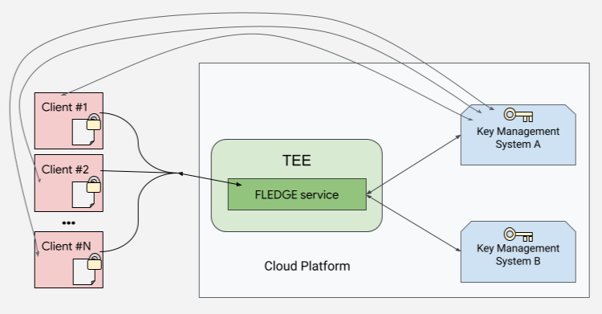
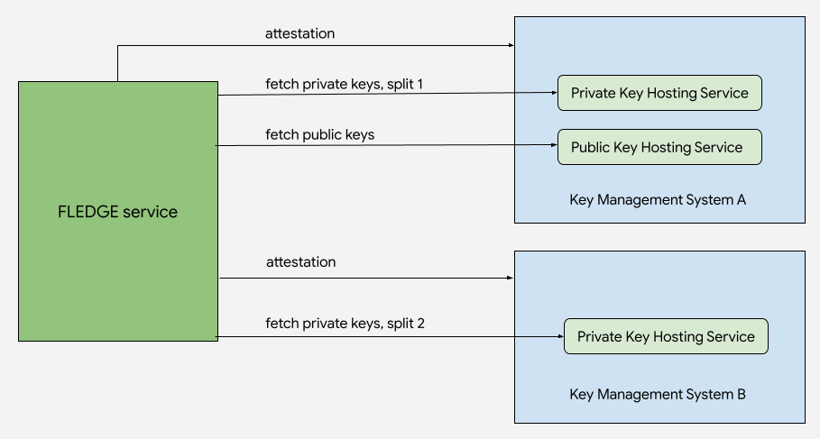
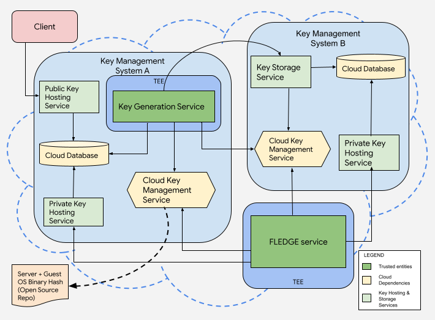

# Overview of FLEDGE Services

The [Privacy Sandbox](https://privacysandbox.com) aims to develop technologies
that reduce cross-site and cross-app tracking while helping to keep online
content and services free for all on Android and Chrome. FLEDGE
([Android](https://developer.android.com/design-for-safety/ads/fledge),
[Chrome](https://developer.chrome.com/docs/privacy-sandbox/fledge/)) provides a
privacy-preserving way to serve personalized ads to users, based on their
previous mobile app or web engagement, in ways that limit third-party data
sharing. FLEDGE for Android and Chrome requires **real-time
services** running in **secure environments**. 

Ad remarketing is one of the primary uses of FLEDGE. Real-time services are
critical for FLEDGE because:

*   Real-time signals from adtechs are required to serve remarketing ads.
*   Some computations may be overly-expensive or infeasible to execute on
    client devices. As these computations are necessary, they should be able
    to be offloaded to the cloud, without affecting the speed or privacy of
    the ad auction and bidding service proposed by FLEDGE.

In this document, you’ll find a high-level overview of the proposal for FLEDGE
services.

## Key terms and concepts

Before reading this document, familiarize yourself with these key terms and
concepts:

*   _Adtech_: an enterprise company that develops technology to serve ads to
     users on different mediums. In this context, adtech may refer to:
    *   _Supply-side platform ("sellers"):_ A digital advertising company that
         works with publishers to determine what ads to show in the ad slots
         offered by the publisher.
    *   _Demand-side platform ("buyers")_: A digital advertising company that
         works with advertisers to display ads across various ad slots made
         available by publishers.
*   _Client / client software_: An Android device or a Chrome browser that
     supports the Privacy Sandbox.
*   _[Trusted execution environment (TEE)](#trusted-execution-environment)_: A
     combination of hardware and software that provides a secure environment.
     TEEs allow code to execute in isolation and protect data that exists
     within it. TEEs allow external parties to verify that the software does
     exactly what the software manufacturer claims it does—nothing more or
     less. Communication between the client and the TEE is encrypted, as is
     communication between the TEE and another TEE.
*   _FLEDGE service_: A real-time service that runs inside of a TEE, that
     can’t be accessed by any other workload or process running on the same
     machine. The service code is open source and externally verifiable.
     These services are not modifiable by their operators or infrastructure
     admins.
*   _Service operator_: An entity that operates real-time services to support
     FLEDGE.
*   _[Key management system](#key-management-systems)_: A centralized component
    that generates, manages and distributes cryptographic keys to clients and
    services.
*   _Attestation_: A mechanism to authenticate software identity with
    [cryptographic hashes](https://en.wikipedia.org/wiki/Cryptographic_hash_function)
    or signatures.

### Trusted execution environment

A [trusted execution environment (TEE)](https://confidentialcomputing.io/wp-content/uploads/sites/85/2021/03/confidentialcomputing_outreach_whitepaper-8-5x11-1.pdf)
provides a level of assurance for data integrity, data confidentiality, and
code integrity. A hardware-based TEE uses hardware-backed techniques to
provide increased security guarantees for code execution and data protection
within that environment.

Some of the key properties of a TEE include:

*   Applications that run in a TEE cannot be observed or modified by any other
    process running on the host machine.
*   Protect data-in-use. Data processed in-memory within the service is
    encrypted.

### Cloud platform

Services running in TEE should be deployed on a cloud platform that supports
necessary security features. **Details specific to cloud platform support
will be published at a later date. We expect to support  Amazon Web Services
(AWS), Google Cloud Platform (GCP), and other cloud providers in the future.**

## Privacy considerations

In the proposed architecture for the FLEDGE services, we’ve made the following
privacy considerations:

*   Service operators can run real-time services on a public cloud platform
    that supports the necessary security features. 
*   Privacy protection of the FLEDGE service and the binary version of the
    virtual machine’s guest operating system are externally verifiable.
*   The FLEDGE services run in a TEE.
*   Service code, APIs, and configurations are open source and externally
    verifiable.
    *   Note: Closed-source proprietary code can run within a TEE. In this
        trust model, closed-source proprietary code execution is allowed for
        certain use cases where execution is limited to another sandbox in
        the same TEE that preserves the same privacy considerations and
        security goals.
*   The service code is attested. 
*   Data sent from the client is not persisted.
*   Sensitive data will not be exfiltrated out of the service.
*   The service operator is not able to access any sensitive data processed by
    the service.
*   No single entity can act alone to gain access to data from clients used to
    facilitate the FLEDGE information flow.

## Security goals

*   Data in transit from client to real-time service is encrypted (client to
    service communication is encrypted).
*   Communication between two different TEEs is encrypted.
*   Cloud providers and service operators can not observe anything in a TEE.
*   Sensitive data cannot be logged. Prevention of sensitive data logging is
    enforced by security policies that are attested at service startup.
*   Logs, core memory dumps, crashes, and stack traces do not reveal sensitive
    information.
*   Adtechs cannot access decryption keys in cleartext.

## Trust model

This section describes the trust model for FLEDGE services. In this context,
trust is based on cryptographic verification by external parties. The model
is expected to be trusted by all entities, including adtechs and clients.

### Root of trust

A root of trust in this context implies that all other trust in the system can
be logically derived from it. For the FLEDGE services, the cloud platform and
hardware manufacturers are at the root of trust.

### Entities with trust

The cloud platform as an entity is considered trusted in this model: 

*   Secure virtual machine backed by TEE hardware on which FLEDGE service will
    be hosted, is trusted. 
*   [Key management systems](#key-management-systems) are trusted.

### Entities without trust

The following entities are inherently without trust:

*   Service operators.
*   A client, such as an app or browser.
    *   For Android, the device must be attested before the client can make an
        outgoing request to a FLEDGE service. The details for Android device
        attestation will be published in a later document.
    *   Browsers are not required to attest when querying service APIs. As
        such, there is a risk of the information served being visible to
        entities beyond the browser. Service operators should be aware of
        this when designing their application.

## System overview

Adtechs can use FLEDGE services to perform several different actions (such as
lookup real-time data as well as executing programmatic bidding and
auctions). There are several entities that operate together in the systems.

*   The [clients](#clients) send encrypted requests to a FLEDGE service. To
    encrypt these requests, the client prefetches and caches the public key
    from a key management system.
*   The FLEDGE service
    [communicates with the client](#client-to-service-communication) to
    return encrypted responses.
*   [The FLEDGE service](#fledge-services) runs within a TEE, and
    communicates with two key management systems to prefetch private keys to
    decrypt and process the request.
*   Two [key management systems](#key-management-systems) maintain services
    and databases to generate and distribute public and private keys.

### Clients

Client software periodically fetches a set of public keys from the public key
hosting service.

Public keys are cached client-side with a fixed TTL (in order of days) and are
considered valid by the service for sufficiently longer. New versions of keys
are prefetched before the expiration time of the previous set.

The client encrypts the request payload with a version of the public key.
Then, the client sends the request and the version of the public key to the
FLEDGE service.

### Client-to-service communication

Client to FLEDGE service communication is encrypted using
[Bidirectional Hybrid Public Key Encryption (HPKE)](https://www.rfc-editor.org/rfc/rfc9180.html#name-bidirectional-encryption).

#### Request encryption

To encrypt the request, the client establishes a connection with the FLEDGE
service endpoint. This ensures that the client is talking to the correct
operator and server instance. This alone does not guarantee that the operator
can be trusted to handle the request.

The client encrypts the request with the public key. The client sends the
request, which includes a clear text message indicating the version of the
public key, to the FLEDGE service.

The client won't directly verify the identity of the destination service.
Instead, the request remains secure because the private keys are only
available to the service after it has been attested.

#### Request decryption

Upon receiving a request, the FLEDGE service checks the version of the public
key and either lookup corresponding private keys from its in-memory cache.

The FLEDGE service decrypts the request using split private keys, processes
the request and then returns an encrypted response back to the client. 

#### Response protection

The response is encrypted  with a
[key material and nonce derived from HPKE context](https://www.rfc-editor.org/rfc/rfc9180.html#name-bidirectional-encryption).

HPKE does not require additional round trips or have extra latency overhead.

### FLEDGE services

Each FLEDGE service is hosted in a secure virtual machine (TEE). Secure
virtual machines run on physical hosts powered by secure hardware
processors. 

The FLEDGE service sends requests to the key management system to fetch
private keys and public keys at service bootstrap. Before such keys are
granted to the service, the binary hash of the FLEDGE service and guest
operating system running on the virtual machine is validated against a hash
of the open source image; this validation process is termed as attestation.

*   The FLEDGE service sends requests to private key hosting services to
    pre-fetch private keys. Private keys are granted to a FLEDGE service only
    after attestation.
    *   A private key is split into two fragments. These fragments are fetched
        from the private key hosting endpoints which belong to Key Management
        System A and Key Management System B.
    *   Both fragments of private keys are required to decrypt requests from
        clients.
    *   The FLEDGE service periodically fetches private keys corresponding to
        all valid key versions and caches them in-memory. This also ensures
        if clients encrypt requests using any valid public key, the service
        can decrypt the requests.
*   FLEDGE services can send requests to other FLEDGE services or other
    trusted entities. Requests to other FLEDGE services would be encrypted
    using a public key and decrypted at the destination using the
    corresponding private key. Refer to the
    [Bidding and Auction Service explainer](https://github.com/privacysandbox/fledge-docs/blob/main/bidding_auction_services_api.md)
    as an example of an architecture where a FLEDGE service communicates with
    other FLEDGE services.
*   Public and private keys are periodically prefetched and cached. The key
    caching TTL within the service is in the order of hours.

### Key management systems

A _key management system_ includes multiple services that are tasked with:

*   Generating a public-private key pair used for encryption and decryption.
*   Provisioning keys to end-user devices.
*   Provisioning key pairs to real-time services.

In this proposal, two separate trusted parties operate key management
systems.

#### Key Management System A

Key Management System A includes:

*   A **cloud database** for encryption key storage.
*   A **cloud key management service (cloud KMS)** for encryption key
    management.
*   A **key generation service**. 
    *   The key generation service runs in a TEE. The key generation service
        generates public keys and splits private key pairs that are used to
        encrypt and decrypt each request and response. New keys are generated
        every 7 days.
*   A **public key hosting service**.
    *   The public key hosting service exposes an API endpoint that returns
        active public keys.
*   A **private key hosting service**.
    *   The private key hosting service exposes an API endpoint that returns
        an encrypted private key split fragment that belongs to "Key
        Management System A". The key fragment is encrypted using a cloud
        KMS.

#### Key Management System B

Key Management System B includes:

*   A **cloud database** for encryption key storage.
*   A **cloud key management service (cloud KMS)** for encryption key
    management.
*   A **key storage service**.
    *   This service exposes an endpoint that is called by the key generation
        service to store one of the encrypted private key fragments.
*   A **private key hosting service**.
    *   The private key hosting service exposes an API endpoint that returns
        an encrypted private key split fragment that belongs to "Key
        Management System B". The key fragment is encrypted using a cloud
        KMS.

#### Public and private keys

Every public and private key pair has a corresponding version number. 

Public keys are used to encrypt requests. Private keys are used to decrypt the
request. To perform decryption, the version of the private key must
correspond to the version of the public key that is used for encryption.

Public keys have a client side time-to-live (TTL) of N days. Corresponding
private keys should have a TTL of at least N+1 days.

## Initial plans for release and deployment

### Release by Google

*   Developers author open source service code and Google releases source code
    to an open source repository (GitHub). 
*   Google may also publish build artifacts to an open source repo in
    [github.com/privacysandbox](https://github.com/privacysandbox) org for
    binary validation.

### Deployment by adtechs

Adtechs will deploy FLEDGE services from an open source repository that follow
helper guides provided by Google. This includes running binaries of the
service in the TEE setup specific to a cloud platform. Adtechs are
responsible for the productionization of FLEDGE services operated by them.

Details regarding Key Management Systems deployment will be published at a
later date.

## FLEDGE services

The Privacy Sandbox is proposing the following open source services for FLEDGE
that run in TEEs and are operated by adtechs.

### Key/value services

Lookup service for fetching real-time signals from adtechs. This is a critical
path dependency for remarketing bidding & auctions. 

Refer to the
[Key/Value service API explainer](https://github.com/WICG/turtledove/blob/main/FLEDGE_Key_Value_Server_API.md)
for more information.

### Bidding and auction services

Programmatic bidding and auction can be computation heavy, such that it may be
infeasible to execute on user's devices. This could be due to system health
considerations and ad latency constraints. The FLEDGE Bidding and Auction
service executes ad bidding and auctions remotely in the TEE.

Refer to the
[Bidding and auction service API explainer](https://github.com/privacysandbox/fledge-docs/blob/main/bidding_auction_services_api.md)
for more information. There will be follow up documents describing the design of
ad bidding and auction services.
